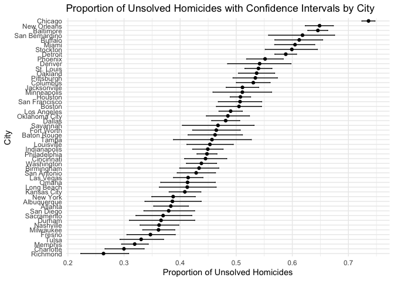
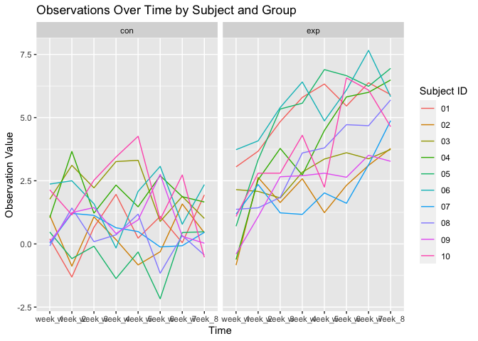
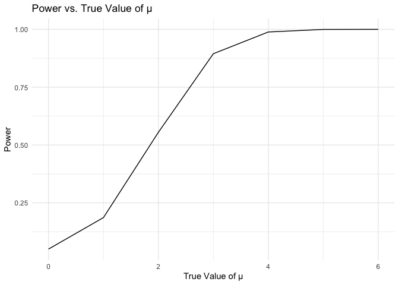
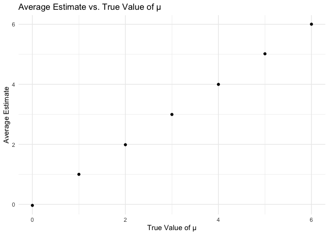
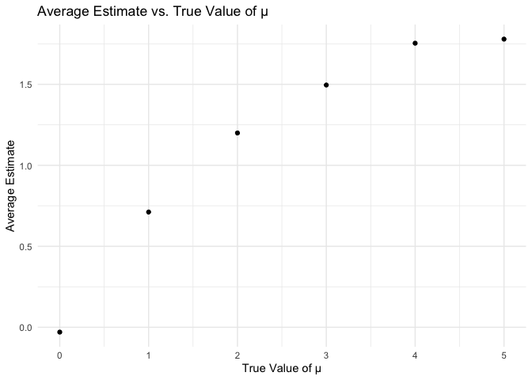

p8105_hw5_zx2482
================
Allison Xia
2023-11-15

``` r
library(dplyr)
```

    ## 
    ## Attaching package: 'dplyr'

    ## The following objects are masked from 'package:stats':
    ## 
    ##     filter, lag

    ## The following objects are masked from 'package:base':
    ## 
    ##     intersect, setdiff, setequal, union

``` r
library(tidyverse)
```

    ## ── Attaching core tidyverse packages ──────────────────────── tidyverse 2.0.0 ──
    ## ✔ forcats   1.0.0     ✔ readr     2.1.4
    ## ✔ ggplot2   3.4.3     ✔ stringr   1.5.0
    ## ✔ lubridate 1.9.2     ✔ tibble    3.2.1
    ## ✔ purrr     1.0.2     ✔ tidyr     1.3.0

    ## ── Conflicts ────────────────────────────────────────── tidyverse_conflicts() ──
    ## ✖ dplyr::filter() masks stats::filter()
    ## ✖ dplyr::lag()    masks stats::lag()
    ## ℹ Use the conflicted package (<http://conflicted.r-lib.org/>) to force all conflicts to become errors

``` r
library(stringr)
library(broom)
library(purrr)
library(ggplot2)
```

### Problem 1

``` r
homicides = read.csv("homicide-data.csv")
str(homicides)
```

    ## 'data.frame':    52179 obs. of  12 variables:
    ##  $ uid          : chr  "Alb-000001" "Alb-000002" "Alb-000003" "Alb-000004" ...
    ##  $ reported_date: int  20100504 20100216 20100601 20100101 20100102 20100126 20100127 20100127 20100130 20100210 ...
    ##  $ victim_last  : chr  "GARCIA" "MONTOYA" "SATTERFIELD" "MENDIOLA" ...
    ##  $ victim_first : chr  "JUAN" "CAMERON" "VIVIANA" "CARLOS" ...
    ##  $ victim_race  : chr  "Hispanic" "Hispanic" "White" "Hispanic" ...
    ##  $ victim_age   : chr  "78" "17" "15" "32" ...
    ##  $ victim_sex   : chr  "Male" "Male" "Female" "Male" ...
    ##  $ city         : chr  "Albuquerque" "Albuquerque" "Albuquerque" "Albuquerque" ...
    ##  $ state        : chr  "NM" "NM" "NM" "NM" ...
    ##  $ lat          : num  35.1 35.1 35.1 35.1 35.1 ...
    ##  $ lon          : num  -107 -107 -107 -107 -107 ...
    ##  $ disposition  : chr  "Closed without arrest" "Closed by arrest" "Closed without arrest" "Closed by arrest" ...

#### Describe the raw data.

``` r
homicides =  
  homicides |> 
  unite("city_state", city:state, sep = ", ", remove = FALSE)
homicides |> 
  group_by(city) |> 
  summarize(total_count = n())
```

    ## # A tibble: 50 × 2
    ##    city        total_count
    ##    <chr>             <int>
    ##  1 Albuquerque         378
    ##  2 Atlanta             973
    ##  3 Baltimore          2827
    ##  4 Baton Rouge         424
    ##  5 Birmingham          800
    ##  6 Boston              614
    ##  7 Buffalo             521
    ##  8 Charlotte           687
    ##  9 Chicago            5535
    ## 10 Cincinnati          694
    ## # ℹ 40 more rows

``` r
homicides |> 
  filter(disposition == "Closed without arrest" | disposition =="Open/No arrest") |> 
  group_by(city) |> 
  summarize(count = n())
```

    ## # A tibble: 50 × 2
    ##    city        count
    ##    <chr>       <int>
    ##  1 Albuquerque   146
    ##  2 Atlanta       373
    ##  3 Baltimore    1825
    ##  4 Baton Rouge   196
    ##  5 Birmingham    347
    ##  6 Boston        310
    ##  7 Buffalo       319
    ##  8 Charlotte     206
    ##  9 Chicago      4073
    ## 10 Cincinnati    309
    ## # ℹ 40 more rows

Create a `city_state` variable (e.g. “Baltimore, MD”) and then summarize
within cities to obtain the total number of homicides and the number of
unsolved homicides (those for which the disposition is “Closed without
arrest” or “Open/No arrest”).

For the city of Baltimore, MD, use the prop.test function to estimate
the proportion of homicides that are unsolved; save the output of
prop.test as an R object, apply the broom::tidy to this object and pull
the estimated proportion and confidence intervals from the resulting
tidy dataframe.

``` r
# Subset data for Baltimore
baltimore_data =
  homicides |> 
  filter(city_state == "Baltimore, MD")

# Apply prop.test
# Sum of unsolved cases and total number of cases
baltimore_data_unsolved = 
  baltimore_data |> 
  filter(disposition == "Closed without arrest" | disposition =="Open/No arrest")

prop_test_result = prop.test(nrow(baltimore_data_unsolved),nrow(baltimore_data))

# Use broom::tidy to tidy the prop.test result
tidy_result <- broom::tidy(prop_test_result)

# Extracting the estimated proportion and confidence intervals
estimated_proportion = 
  tidy_result |> 
  pull(estimate)
conf_low = 
  tidy_result |> 
  pull(conf.low)
conf_high = 
  tidy_result |> 
  pull(conf.high)

# Display the results
print(paste("Estimated proportion of unsolved cases: ", estimated_proportion))
```

    ## [1] "Estimated proportion of unsolved cases:  0.645560665015918"

``` r
print(paste("95% Confidence Interval: [", conf_low, ", ", conf_high, "]", sep = ""))
```

    ## [1] "95% Confidence Interval: [0.627562457662644, 0.663159860401662]"

Now run prop.test for each of the cities in your dataset, and extract
both the proportion of unsolved homicides and the confidence interval
for each. Do this within a “tidy” pipeline, making use of purrr::map,
purrr::map2, list columns and unnest as necessary to create a tidy
dataframe with estimated proportions and CIs for each city.

``` r
tidy_results = homicides |> 
  group_by(city) |> 
  nest() |> 
  mutate(
    prop_test = map(data, ~prop.test(
      sum(.x$disposition == "Closed without arrest" | .x$disposition == "Open/No arrest"), 
      nrow(.x)
    )),
    tidy_prop_test = map(prop_test, broom::tidy)
  ) |> 
  select(-data, -prop_test) |> 
  unnest(tidy_prop_test)
```

Create a plot that shows the estimates and CIs for each city – check out
geom_errorbar for a way to add error bars based on the upper and lower
limits. Organize cities according to the proportion of unsolved
homicides.

``` r
ggplot(tidy_results, aes(x = reorder(city, estimate), y = estimate)) +
  geom_point() +
  geom_errorbar(aes(ymin = conf.low, ymax = conf.high), width = 0.2) +
  coord_flip() +  # Flips the axes for better readability
  labs(x = "City", y = "Proportion of Unsolved Homicides", 
       title = "Proportion of Unsolved Homicides with Confidence Intervals by City") +
  theme_minimal()
```

<!-- -->

Problem 2

This zip file contains data from a longitudinal study that included a
control arm and an experimental arm. Data for each participant is
included in a separate file, and file names include the subject ID and
arm.

Create a tidy dataframe containing data from all participants, including
the subject ID, arm, and observations over time

``` r
file_names = list.files("data", full.names = TRUE)
data = map_df(file_names, read_csv, .id = "file_name")
```

    ## Rows: 1 Columns: 8
    ## ── Column specification ────────────────────────────────────────────────────────
    ## Delimiter: ","
    ## dbl (8): week_1, week_2, week_3, week_4, week_5, week_6, week_7, week_8
    ## 
    ## ℹ Use `spec()` to retrieve the full column specification for this data.
    ## ℹ Specify the column types or set `show_col_types = FALSE` to quiet this message.
    ## Rows: 1 Columns: 8
    ## ── Column specification ────────────────────────────────────────────────────────
    ## Delimiter: ","
    ## dbl (8): week_1, week_2, week_3, week_4, week_5, week_6, week_7, week_8
    ## 
    ## ℹ Use `spec()` to retrieve the full column specification for this data.
    ## ℹ Specify the column types or set `show_col_types = FALSE` to quiet this message.
    ## Rows: 1 Columns: 8
    ## ── Column specification ────────────────────────────────────────────────────────
    ## Delimiter: ","
    ## dbl (8): week_1, week_2, week_3, week_4, week_5, week_6, week_7, week_8
    ## 
    ## ℹ Use `spec()` to retrieve the full column specification for this data.
    ## ℹ Specify the column types or set `show_col_types = FALSE` to quiet this message.
    ## Rows: 1 Columns: 8
    ## ── Column specification ────────────────────────────────────────────────────────
    ## Delimiter: ","
    ## dbl (8): week_1, week_2, week_3, week_4, week_5, week_6, week_7, week_8
    ## 
    ## ℹ Use `spec()` to retrieve the full column specification for this data.
    ## ℹ Specify the column types or set `show_col_types = FALSE` to quiet this message.
    ## Rows: 1 Columns: 8
    ## ── Column specification ────────────────────────────────────────────────────────
    ## Delimiter: ","
    ## dbl (8): week_1, week_2, week_3, week_4, week_5, week_6, week_7, week_8
    ## 
    ## ℹ Use `spec()` to retrieve the full column specification for this data.
    ## ℹ Specify the column types or set `show_col_types = FALSE` to quiet this message.
    ## Rows: 1 Columns: 8
    ## ── Column specification ────────────────────────────────────────────────────────
    ## Delimiter: ","
    ## dbl (8): week_1, week_2, week_3, week_4, week_5, week_6, week_7, week_8
    ## 
    ## ℹ Use `spec()` to retrieve the full column specification for this data.
    ## ℹ Specify the column types or set `show_col_types = FALSE` to quiet this message.
    ## Rows: 1 Columns: 8
    ## ── Column specification ────────────────────────────────────────────────────────
    ## Delimiter: ","
    ## dbl (8): week_1, week_2, week_3, week_4, week_5, week_6, week_7, week_8
    ## 
    ## ℹ Use `spec()` to retrieve the full column specification for this data.
    ## ℹ Specify the column types or set `show_col_types = FALSE` to quiet this message.
    ## Rows: 1 Columns: 8
    ## ── Column specification ────────────────────────────────────────────────────────
    ## Delimiter: ","
    ## dbl (8): week_1, week_2, week_3, week_4, week_5, week_6, week_7, week_8
    ## 
    ## ℹ Use `spec()` to retrieve the full column specification for this data.
    ## ℹ Specify the column types or set `show_col_types = FALSE` to quiet this message.
    ## Rows: 1 Columns: 8
    ## ── Column specification ────────────────────────────────────────────────────────
    ## Delimiter: ","
    ## dbl (8): week_1, week_2, week_3, week_4, week_5, week_6, week_7, week_8
    ## 
    ## ℹ Use `spec()` to retrieve the full column specification for this data.
    ## ℹ Specify the column types or set `show_col_types = FALSE` to quiet this message.
    ## Rows: 1 Columns: 8
    ## ── Column specification ────────────────────────────────────────────────────────
    ## Delimiter: ","
    ## dbl (8): week_1, week_2, week_3, week_4, week_5, week_6, week_7, week_8
    ## 
    ## ℹ Use `spec()` to retrieve the full column specification for this data.
    ## ℹ Specify the column types or set `show_col_types = FALSE` to quiet this message.
    ## Rows: 1 Columns: 8
    ## ── Column specification ────────────────────────────────────────────────────────
    ## Delimiter: ","
    ## dbl (8): week_1, week_2, week_3, week_4, week_5, week_6, week_7, week_8
    ## 
    ## ℹ Use `spec()` to retrieve the full column specification for this data.
    ## ℹ Specify the column types or set `show_col_types = FALSE` to quiet this message.
    ## Rows: 1 Columns: 8
    ## ── Column specification ────────────────────────────────────────────────────────
    ## Delimiter: ","
    ## dbl (8): week_1, week_2, week_3, week_4, week_5, week_6, week_7, week_8
    ## 
    ## ℹ Use `spec()` to retrieve the full column specification for this data.
    ## ℹ Specify the column types or set `show_col_types = FALSE` to quiet this message.
    ## Rows: 1 Columns: 8
    ## ── Column specification ────────────────────────────────────────────────────────
    ## Delimiter: ","
    ## dbl (8): week_1, week_2, week_3, week_4, week_5, week_6, week_7, week_8
    ## 
    ## ℹ Use `spec()` to retrieve the full column specification for this data.
    ## ℹ Specify the column types or set `show_col_types = FALSE` to quiet this message.
    ## Rows: 1 Columns: 8
    ## ── Column specification ────────────────────────────────────────────────────────
    ## Delimiter: ","
    ## dbl (8): week_1, week_2, week_3, week_4, week_5, week_6, week_7, week_8
    ## 
    ## ℹ Use `spec()` to retrieve the full column specification for this data.
    ## ℹ Specify the column types or set `show_col_types = FALSE` to quiet this message.
    ## Rows: 1 Columns: 8
    ## ── Column specification ────────────────────────────────────────────────────────
    ## Delimiter: ","
    ## dbl (8): week_1, week_2, week_3, week_4, week_5, week_6, week_7, week_8
    ## 
    ## ℹ Use `spec()` to retrieve the full column specification for this data.
    ## ℹ Specify the column types or set `show_col_types = FALSE` to quiet this message.
    ## Rows: 1 Columns: 8
    ## ── Column specification ────────────────────────────────────────────────────────
    ## Delimiter: ","
    ## dbl (8): week_1, week_2, week_3, week_4, week_5, week_6, week_7, week_8
    ## 
    ## ℹ Use `spec()` to retrieve the full column specification for this data.
    ## ℹ Specify the column types or set `show_col_types = FALSE` to quiet this message.
    ## Rows: 1 Columns: 8
    ## ── Column specification ────────────────────────────────────────────────────────
    ## Delimiter: ","
    ## dbl (8): week_1, week_2, week_3, week_4, week_5, week_6, week_7, week_8
    ## 
    ## ℹ Use `spec()` to retrieve the full column specification for this data.
    ## ℹ Specify the column types or set `show_col_types = FALSE` to quiet this message.
    ## Rows: 1 Columns: 8
    ## ── Column specification ────────────────────────────────────────────────────────
    ## Delimiter: ","
    ## dbl (8): week_1, week_2, week_3, week_4, week_5, week_6, week_7, week_8
    ## 
    ## ℹ Use `spec()` to retrieve the full column specification for this data.
    ## ℹ Specify the column types or set `show_col_types = FALSE` to quiet this message.
    ## Rows: 1 Columns: 8
    ## ── Column specification ────────────────────────────────────────────────────────
    ## Delimiter: ","
    ## dbl (8): week_1, week_2, week_3, week_4, week_5, week_6, week_7, week_8
    ## 
    ## ℹ Use `spec()` to retrieve the full column specification for this data.
    ## ℹ Specify the column types or set `show_col_types = FALSE` to quiet this message.
    ## Rows: 1 Columns: 8
    ## ── Column specification ────────────────────────────────────────────────────────
    ## Delimiter: ","
    ## dbl (8): week_1, week_2, week_3, week_4, week_5, week_6, week_7, week_8
    ## 
    ## ℹ Use `spec()` to retrieve the full column specification for this data.
    ## ℹ Specify the column types or set `show_col_types = FALSE` to quiet this message.

``` r
tidy_data <- data %>%
  mutate(
    subject_id = str_extract(file_names, "\\d+"),
    arm = str_extract(file_names, "con|exp")
  ) %>%
  select(-file_name) %>%
  pivot_longer(
    cols = -c(subject_id, arm),
    names_to = "time",
    values_to = "observation"
  )
```

Make a spaghetti plot showing observations on each subject over time,
and comment on differences between groups.

``` r
str(tidy_data)
```

    ## tibble [160 × 4] (S3: tbl_df/tbl/data.frame)
    ##  $ subject_id : chr [1:160] "01" "01" "01" "01" ...
    ##  $ arm        : chr [1:160] "con" "con" "con" "con" ...
    ##  $ time       : chr [1:160] "week_1" "week_2" "week_3" "week_4" ...
    ##  $ observation: num [1:160] 0.2 -1.31 0.66 1.96 0.23 1.09 0.05 1.94 1.13 -0.88 ...

``` r
ggplot(tidy_data, aes(x = time, y = observation, color = subject_id, group = subject_id)) +
  geom_line() + 
  labs(title = "Observations Over Time by Subject and Group",
       x = "Time",
       y = "Observation Value",
       color = "Subject ID")+
  facet_grid(~arm)
```

<!-- -->

Problem 3

When designing an experiment or analysis, a common question is whether
it is likely that a true effect will be detected – put differently,
whether a false null hypothesis will be rejected. The probability that a
false null hypothesis is rejected is referred to as power, and it
depends on several factors, including: the sample size; the effect size;
and the error variance. In this problem, you will conduct a simulation
to explore power in a one-sample t-test.

First set the following design elements:

Fix n=30 Fix σ=5 Set μ=0. Generate 5000 datasets from the model

x∼Normal\[μ,σ\]

``` r
set.seed(123)  # For reproducibility
n <- 30        # Sample size
sigma <- 5     # Standard deviation
mu_values = 0:6

simulate_data <- function(mu, n, sigma) {
  x <- rnorm(n, mean = mu, sd = sigma)
  test_result <- broom::tidy(t.test(x, mu = 0))
  return(data.frame(mu = mu, estimate = mean(x), p_value = test_result$p.value))
}
```

``` r
n_datasets <- 5000
all_results <- map_df(1:n_datasets, ~map_df(mu_values, ~simulate_data(.x, n, sigma), id = "mu"))
```

``` r
all_results <- all_results %>%
  mutate(mu = as.numeric(mu),
         rejected_null = p_value < 0.05)
```

``` r
all_results %>%
  group_by(mu) %>%
  summarize(power = mean(rejected_null)) |> 
  ggplot(aes(x = as.numeric(mu), y = power)) +
  geom_line() +
  labs(title = "Power vs. True Value of μ",
       x = "True Value of μ",
       y = "Power") +
  theme_minimal()
```

<!-- -->

For each dataset, save μ̂ and the p-value arising from a test of H:μ=0
using α=0.05. Hint: to obtain the estimate and p-value, use broom::tidy
to clean the output of t.test.

Repeat the above for μ={1,2,3,4,5,6}, and complete the following:

Make a plot showing the proportion of times the null was rejected (the
power of the test) on the y axis and the true value of μ on the x axis.
Describe the association between effect size and power. Make a plot
showing the average estimate of μ̂ on the y axis and the true value of μ
on the x axis.

``` r
all_results %>%
  group_by(mu) %>%
  summarize(mean_estimate = mean(estimate)) |> 
  ggplot(aes(x = as.numeric(mu), y = mean_estimate)) +
  geom_point() +
  labs(title = "Average Estimate vs. True Value of μ",
       x = "True Value of μ",
       y = "Average Estimate") +
  theme_minimal()
```

<!-- -->

Make a second plot (or overlay on the first) the average estimate of μ̂
only in samples for which the null was rejected on the y axis and the
true value of μ on the x axis.

``` r
all_results %>%
  group_by(mu) %>%
  filter(rejected_null == FALSE) |> 
  summarize(mean_estimate = mean(estimate)) |> 
  ggplot(aes(x = as.numeric(mu), y = mean_estimate)) +
  geom_point() +
  labs(title = "Average Estimate vs. True Value of μ",
       x = "True Value of μ",
       y = "Average Estimate") +
  theme_minimal()
```

<!-- -->

Is the sample average of μ̂ across tests for which the null is rejected
approximately equal to the true value of μ? Why or why not?
